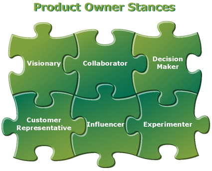
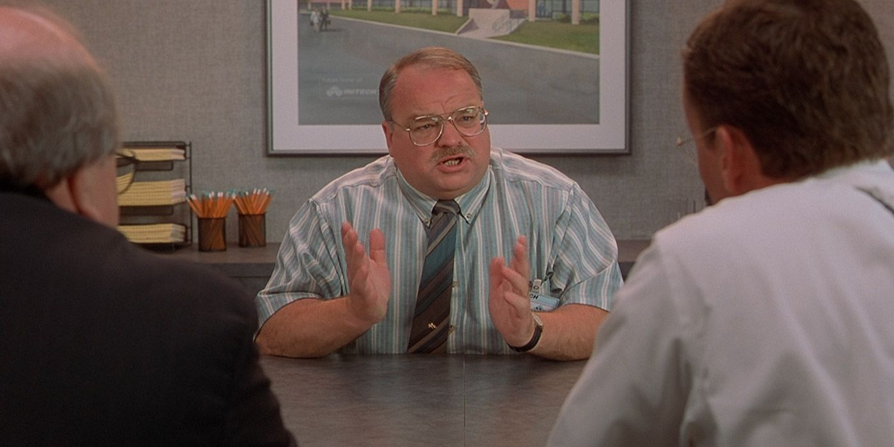
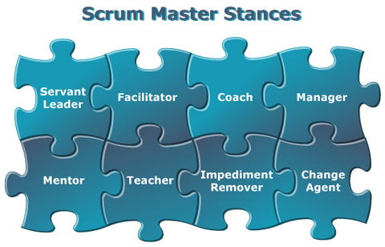

# What is Scrum?

#### Quentin Crain

https://scrumguides.org/scrum-guide.html

https://www.scrum.org/learning-series/what-is-scrum/

---

## Overview

---

## Roles

<!--
Value to Stakeholders
Value to Team
-->

<table>
    <tr>
        <th>Product Owner</th>
        <th>Scrum Master</th>
        <th>Developer</th>
    </tr>
    <tr>
        <td>
            
            
        </td>
        <td>
            
            
        </td>
        <td>
            
        </td>
    </tr>
</table>

---

## Artifacts

<table>
    <tr>
        <th>Product Backlog</th>
        <th>Sprint Backlog</th>
        <th>Work Item</th>
    </tr>
    <tr>
        <td>ordered list of what is needed to improve the product</td>
        <td>work committed by the developers to the PO in a timeframe</td>
        <td>work in the sprint</td>
    </tr>
</table>

---

## Ceremonies

<table>
    <tr>
        <th>Sprint Planning</th>
        <th>Daily Scrum</th>
        <th>Sprint Review</th>
        <th>Sprint Retrospective</th>
    </tr>
    <tr>
        <td>Build sprint backlog</td>
        <td>Review sprint progress</td>
        <td>Review work completed with Stakeholders</td>
        <td>Review sprint effectiveness and make change</td>
    </tr>
</table>

---

## Guidance

At the start of the sprint, you commit to the Customer to deliver items A, B, C of value.

At the Sprint Review, you demo to the Customer what you finished.

---

# E   N   D
