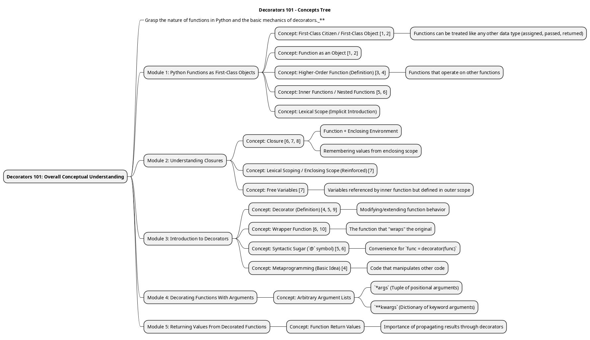
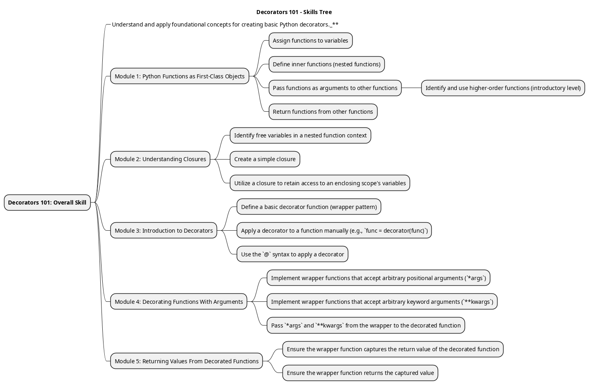
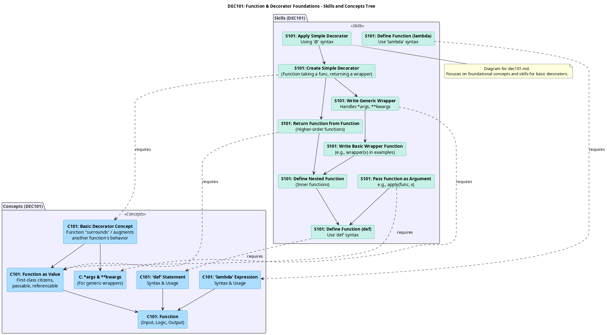
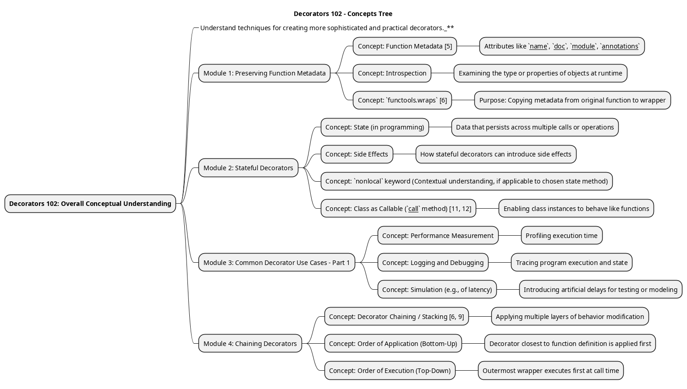
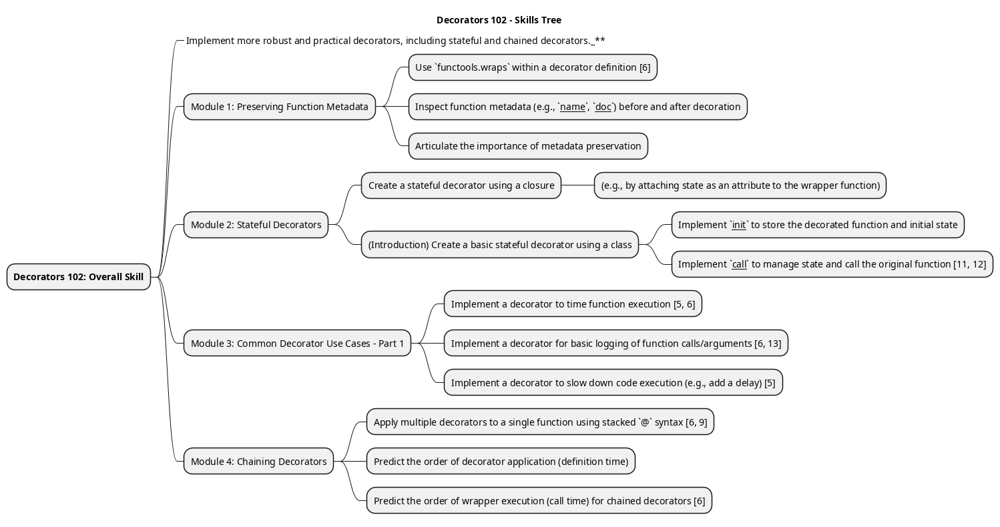
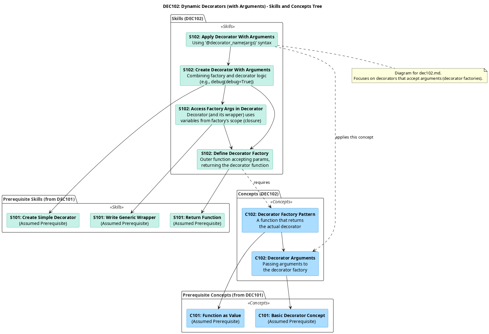
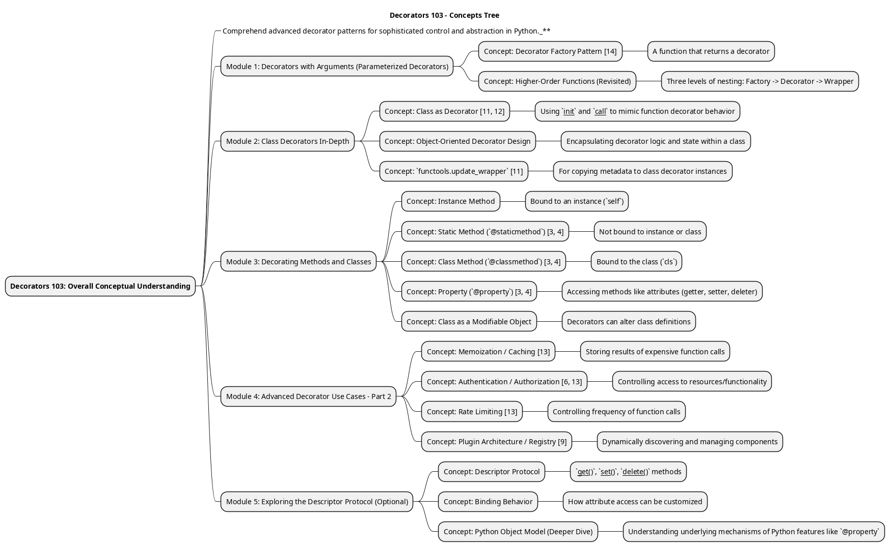
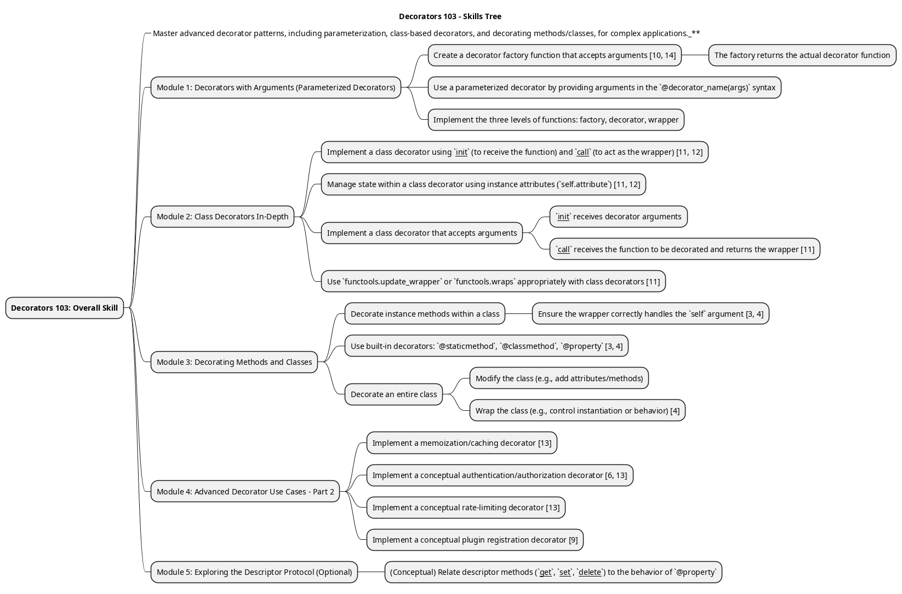
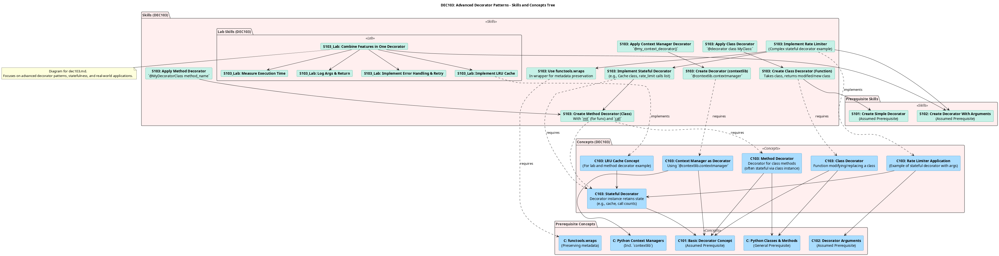

# Decorators in Python

## Concept and Skill Trees

Using google gemini I created the following visualizes of the concept and skill trees as detailed in this paper:

[Structuing Competency-Based Courses Through Skill Trees](StructuingCompetency-BasedCoursesThroughSkillTrees.pdf)

### Decorators 101

### Decorators 102

### Decorators 103

