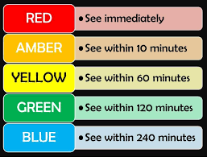

# Data Structures and Algorithms

## Priority Queue

### Two Implementations

Quentin Crain

---

## Agenda

- Objectives
- Quickly: Stacks & Queues
- What and Why is a priority queue?
- Naive Implementation: Sorted List
- What and Why is a heap?
- Performant Implementation: Pairing Heap
- Did this suck?

---

### Objectives

- Selfish: Programming is cool!
  - And sharing is awesome!
- Educative: Want to spread the knowledge!
- Labs: What are they good for?
- Preferential: What sorts of presentations do people want?
  - "Academic" vs "Project"
  - "Informational" vs "Interactive"
  - "Theoretical" vs "Practical"
  - "Educative" vs "Inspirational"

---

### Stacks & Queues

<table>
  <tr>
    <td colspan="2">
	  
	</td>
  </tr>
  <tr>
    <td width="50%" align="center">
	  
	   
      <a href="https://en.wikipedia.org/wiki/Stack_(abstract_data_type)">LIFO</a>
	</td>
	<td align="center">
	  
	   
	  <a href="https://en.wikipedia.org/wiki/Queue_(abstract_data_type)">FIFO</a>
	</td>
  </tr>
</table>

---

### Priority Queues

The classic example of implementing a medical triage system that sees/orders patients based on severity.

---

### Priority Queues (cont.)

<table>
<tr>
<td>
<pre>
(define names
  '(Valeria Victor Vincent Vivian
            Varsha Vidya Vinny Van Veda))
(define codes '((red 0 1) (amber 1 10) (yellow 11 60)
                          (green 61 120) (blue 121 240)))
(define patients
  (for/list ((name names))
    (match (list-ref codes (random 5))
      ((list code min max)
       (list name code (random min max))
       ))))
</pre>
</td>
<td>
<pre>
'((Valeria amber 1)
  (Victor green 84)
  (Vincent amber 6)
  (Vivian red 0)
  (Varsha blue 168)
  (Vidya blue 200)
  (Vinny yellow 56)
  (Van green 98)
  (Veda blue 223))
</pre>
</td>
</tr>
</table>

Let's write the Python code to generate a list of patients with codes and priorities.

<footer>

</footer>

---

### Sorted List Implementation

<table>
<tr>
<td>
<pre>
'((Valeria amber 1)
  (Victor green 84)
  (Vincent amber 6)
  (Vivian red 0)
  (Varsha blue 168)
  (Vidya blue 200)
  (Vinny yellow 56)
  (Van green 98)
  (Veda blue 223))
</pre>
<pre>
(define (insert patient pq (result '()))
  (cond
    ((empty?-list pq)
     (reverse (cons patient result)))
    ((< (third patient) (third (car pq)))
     (INC_COMPS)
     (append (reverse result) (list patient) pq))
    (else
     (INC_COMPS)
     (insert patient (cdr pq) (cons (car pq) result)))
    ))
</pre>
</td>
<td>
<pre>
'((Vivian red 0)
  (Valeria amber 1)
  (Vincent amber 6)
  (Vinny yellow 56)
  (Victor green 84)
  (Van green 98)
  (Varsha blue 168)
  (Vidya blue 200)
  (Veda blue 223))
</pre>
</td>
</tr>
</table>

This takes 31 priority comparisons.

---

### Sorted List Implementation (cont.)

##### O(n)

Let's write the Python code that implements `insert`.

---

### Heaps

<table>
<tr>
<td>
A tree structure with the only constraint that the top of the heap meets some criteria, such as is the <i>minimum</i> or <i>maximum</i> element.
</td>
<td>
<ul>
<li>There is no specific notion around the elements below the top.</li>
<li>Number of children</li>
<li><i>Left</i>/<i>Small</i>- or <i>Right</i>/<i>Large</i>-ness of children</li>
</ul>
</td>
</tr>
<tr>
<td colspan="2">

</td>
</tr>
<tr>
<td colspan="2">
<pre>
                          (PRIORITY DATA (SUBHEAPS ...))
</pre>
</td>
</tr>
</table>

---

### Pairing Heap: Merge

<table>
<tr>
<td>
<pre>
(define (merge q1 q2)
  (cond
    ((empty? q1) q2)
    ((empty? q2) q1)
    ((< (first q1) (first q2))
     (INC_COMPS)
     (build (first q1) (second q1)
            (cons q2 (third q1))))
    (else
     (INC_COMPS)
     (build (first q2) (second q2)
            (cons q1 (third q2))))
    ))
</pre>
</td>
<td>

</td>
</tr>
</table>

Let's write the Python code that implements `merge`.

---

### Pairing Heap: Meld

<table>
<td>
<pre>
(define (meld heaps)
  (match heaps
    ('() (new))
    ((list heap) heap)
    ((list h1 h2 rest ...)
     (merge (merge h1 h2) (meld rest)))
    ))
</pre>
</td>
<td>

</td>
</tr>
</table>

Let's write the Python code that implements `meld`.

---

### Pairing Heap: Implementation

<table>
<tr>
<td rowspan="2">
<pre>
'((Valeria amber 1)
  (Victor green 84)
  (Vincent amber 6)
  (Vivian red 0)
  (Varsha blue 168)
  (Vidya blue 200)
  (Vinny yellow 56)
  (Van green 98)
  (Veda blue 223))
</pre>
</td>
<td>
<pre class="medium-size">
(define (merge q1 q2)
  (cond
    ((empty? q1) q2)
    ((empty? q2) q1)
    ((< (first q1) (first q2))
     (INC_COMPS)
     (build (first q1) (second q1)
            (cons q2 (third q1))))
    (else
     (INC_COMPS)
     (build (first q2) (second q2)
            (cons q1 (third q2))))
    ))
</pre>
</td>
<td>
<pre>
'(0
  Vivian
  ((223 Veda ())
   (98 Van ())
   (56 Vinny ())
   (200 Vidya ())
   (168 Varsha ())
   (1 Valeria ((6 Vincent ())
               (84 Victor ())))))
</pre>
8 comparisons
</td>
<tr>
<td>
<pre class="medium-size">
(define (meld heaps)
  (match heaps
    ('() (new))
    ((list heap) heap)
    ((list h1 h2 rest ...)
     (merge (merge h1 h2)
            (meld rest)))
    ))
</pre>
</td>
<td>
<pre>
'(1
  Valeria
  ((98 Van ((223 Veda ())))
   (56 Vinny ((200 Vidya ())))
   (168 Varsha ())
   (6 Vincent ())
   (84 Victor ())))
</pre>
+5 comparisons
</td>
</tr>
</table>

<footer>

</footer>

---

# Thoughts?

| Function | Sorted List | Pairing Heap |
| :---: | :---: | :---: |
| `top` | `O(1)` | `O(1)` |
| `insert` | `O(n)` | `O(1)` |
| `remove` | `O(1)` | `O(log n)` |

https://en.wikipedia.org/wiki/Pairing_heap

---

## References

- https://en.wikipedia.org/wiki/Priority_queue
- https://en.wikipedia.org/wiki/Pairing_heap
- https://www.semanticscholar.org/paper/Verification-of-Costless-Merge-Pairing-Heaps-Hook/556fce923077eda19e8c83a995577ce84bd12359
- Had a chat w/ [Claude 3 Opus](chat.pdf)
